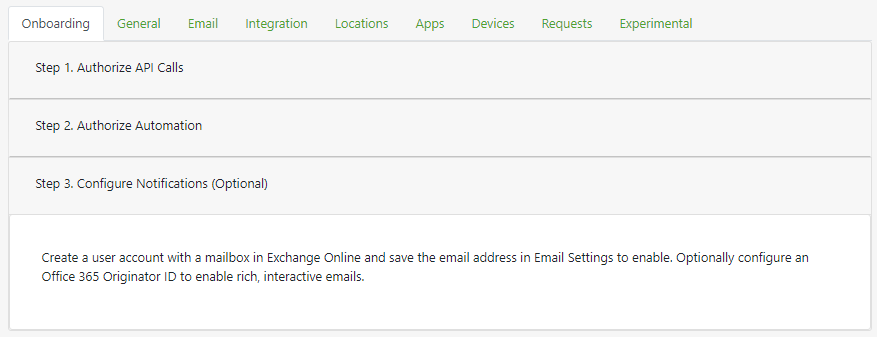

MovoSuite for Microsoft Intune delivers a simple, powerful self-service experience for deploying apps to classroom iPads.

## Table of Contents

- [Install and Configuration Checklist](#install-and-configuration-checklist)
- [Home Screen](#home-screen)
- [Request Deployment](#request-deployment)
- [Request App](#request-app)
- [Configuration](#configuration)
  - [Onboarding](#onboarding)
  - [General](#general)
  - [Email](#email)
  - [Integration](#integration)
  - [Locations](#locations)
  - [Apps](#apps)
  - [Devices](#devices)
  - [Requests](#requests)
  - [Experimental](#experimental)

## Install and Configuration Checklist<!-- omit in toc -->

[back to ToC](#table-of-contents)

## Home Screen<!-- omit in toc -->

**FIGURE X**. MovoSuite Home

[back to ToC](#table-of-contents) | [back to checklist](#install-and-configuration-checklist)

## Request Deployment<!-- omit in toc -->

*To X, perform the following steps:*

**FIGURE X**. Figure Description

[back to ToC](#table-of-contents)

## Request App<!-- omit in toc -->

*To X, perform the following steps:*

**FIGURE X**. Figure Description

[back to ToC](#table-of-contents)

## Configuration<!-- omit in toc -->

**FIGURE X**. Figure Description

[back to ToC](#table-of-contents)

### Onboarding<!-- omit in toc -->

*To X, perform the following steps:*

**FIGURE X**. Figure Description

[back to ToC](#table-of-contents)

### General<!-- omit in toc -->

**FIGURE X**. Figure Description

[back to ToC](#table-of-contents)

### Email<!-- omit in toc -->

*To X, perform the following steps:*

**FIGURE X**. Figure Description

[back to ToC](#table-of-contents)

### Integration<!-- omit in toc -->

*To X, perform the following steps:*

**FIGURE X**. Figure Description

[back to ToC](#table-of-contents)

### Locations<!-- omit in toc -->

*To X, perform the following steps:*

**FIGURE X**. Figure Description

[back to ToC](#table-of-contents)

### Apps<!-- omit in toc -->

*To X, perform the following steps:*

**FIGURE X**. Figure Description

[back to ToC](#table-of-contents)

### Devices <!-- omit in toc -->

*To X, perform the following steps:*

**FIGURE X**. Figure Description

[back to ToC](#table-of-contents)

### Requests<!-- omit in toc -->

*To X, perform the following steps:*

**FIGURE X**. Figure Description

[back to ToC](#table-of-contents)

### Experimental<!-- omit in toc -->

*To X, perform the following steps:*

**FIGURE X**. Figure Description

[back to ToC](#table-of-contents)