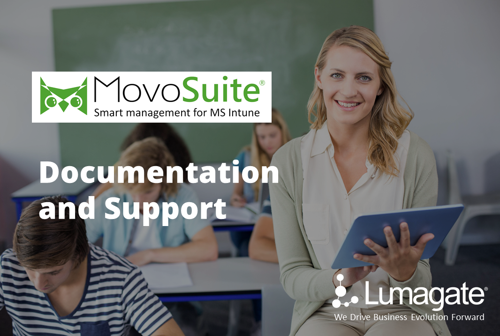

MovoSuite for Microsoft Intune delivers a simple, powerful self-service experience for deploying apps to classroom iPads, with comprehensive backend automation and monitoring capabilities.

## Core Features

### Self-Service Portal
- [User Guide](./selfservice/README.md) - Deploy and procure apps through intuitive interface
- [Admin Guide](./config/README.md) - Comprehensive configuration and management

### Backend Capabilities (v8.2.16)

#### Automated Device Management
- **Scheduled Device Updates** - Automatic device list synchronization every 30 minutes
- **Device Cleanup** - Automated duplicate device detection and cleanup
- **Device Renaming** - Bulk device renaming with PowerShell script integration
- **Device Backup/Restore** - Comprehensive device state management
- **Extension Attribute Management** - Automated device metadata updates

#### Application Management
- **App List Synchronization** - Scheduled app catalog updates and metadata refresh
- **App Builder Integration** - Intune app packaging and publishing via Lumagate.Intune.AppBuilder
- **Apple Store Integration** - Direct integration with Apple Store API for app procurement
- **App Approval Workflows** - Automated approval flag management and group-based deployment

#### Notification & Alert System
- **Microsoft Teams Integration** - Adaptive Cards for deployment approvals and notifications
- **Email Notifications** - HTML-formatted notifications with custom branding
- **Connector Cards** - Microsoft 365 connector card support for legacy systems
- **Service Health Monitoring** - Proactive alerts for certificate expirations, token renewals, and service issues

#### Integration Capabilities
- **TOPdesk Integration** - Service desk ticket creation and management
- **EBase Client** - Asset management system integration
- **Apple VPP** - Volume Purchase Program token and certificate management
- **Microsoft Graph** - Full Azure AD and Intune API integration

#### Scheduled Automation
- **License Monitoring** - Automated license usage tracking and compliance checks
- **Health Checks** - Apple integration monitoring and Microsoft service health validation
- **Location Management** - Automated location code extraction and group creation
- **Data Migration** - Automated data synchronization from external asset management systems

#### Orchestration & Workflows
- **Durable Functions** - Long-running workflow orchestration for complex operations
- **Bot Framework** - Interactive bot for Teams-based approvals and notifications
- **HTTP Triggers** - On-demand function execution for manual operations
- **Timer-based Scheduling** - Configurable cron-based automation

### Documentation & Support
- [Change Log](./CHANGELOG.md)
- [FAQ](./FAQs.md)