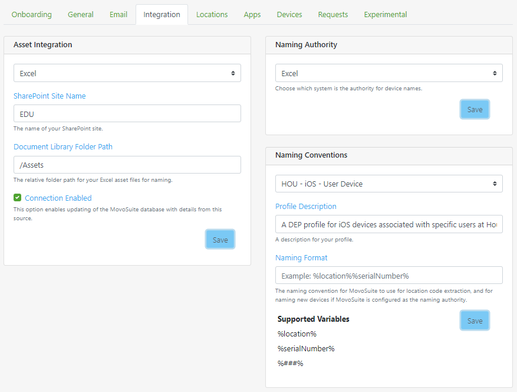

MovoSuite for Microsoft Intune delivers a simple, powerful self-service experience for deploying apps to classroom iPads.

## Table of Contents

- [Install and Configuration Checklist](#install-and-configuration-checklist)
- [Prerequisites](#prerequisites)
- [Home Screen](#home-screen)
- [Request Deployment](#request-deployment)
- [Request App](#request-app)
- [Configuration](#configuration)
  - [Onboarding](#onboarding)
  - [General](#general)
  - [Email](#email)
  - [Integration](#integration)
  - [Locations](#locations)
  - [Apps](#apps)
  - [Devices](#devices)
  - [Requests](#requests)
  - [Experimental](#experimental)

## Install and Configuration Checklist<!-- omit in toc -->

The following is a high-level implementation checklist for MovoSuite, with links to detailed steps for each item on the list. 

*To configure MovoSuite, 1) click the task's link, 2) complete the steps, then 3) click the "return to checklist" link to return to this checklist.*

- **Step 1: Complete and verify the prerequisites**. [HERE](#prerequisites)
- **Step 2: Complete Onboarding Wizard**. Navigate to Configuration, and select the Onboarding tab if not already selected
- **Step 3: Authorize MovoSuite to query Intune**. As a Directory Admin (Global Admin), click 'Authorize Users' under the Step 1 heading. This authorizes MovoSuite to query Intune apps and devices on behalf of your users.
- **Step 4: Authorize MovoSuite for automation**. As a Directory Admin (Global Admin), click 'Authorize Automation' under the Step 2 heading. This authorizes MovoSuite to work with Intune and Azure AD in the background.
- Step 5: Navigate to the Email tab in Configuration. Click 'Create Originator ID' under the Actionable Emails field. Create a new Provider ID named 'MovoSuite' using the parameters specified in the Actionable Emails area.
- **Step 6: Sender email address**. Enter your sender email address in the Sender Address field.The address from which emails are sent.
- **Step 7: Notification email address**. Enter your notification email addresses in the Notifications area
- **Step 8: Test MovoSuite Functionality**. Deploy an app to one of your devices.

[back to ToC](#table-of-contents)

## Prerequisites<!-- omit in toc -->

Before configuring MovoSuite, you should have the following features in place.

- **Intune with DEP and VPP integrated**. 
- **Create an Office 365 email account for sending email**. This account only needs an Exchange Online mailbox. It should be a user account mailbox, not a resource mailbox due to limitations in Microsoft Graph today.
- **Identify an email address for sending notifications/requests to**. This should ideally be an Office 365 Group email address, with members subscribed to emails in order for Actionable (Live) emails to work (shared / resource mailboxes will not render the Actionable emails, and fall back to basic HTML). Alternatively, specify an individual user email address.

Before installing MovoSuite, you should have the following items in place:

[back to ToC](#table-of-contents) | [back to checklist](#install-and-configuration-checklist)

## Home Screen<!-- omit in toc -->

**FIGURE X**. MovoSuite Home

[back to ToC](#table-of-contents) | [back to checklist](#install-and-configuration-checklist)

## Request Deployment<!-- omit in toc -->

*To X, perform the following steps:*

**FIGURE X**. Deployment Request UI

[back to ToC](#table-of-contents) | [back to checklist](#install-and-configuration-checklist)

## Request App<!-- omit in toc -->

*To X, perform the following steps:*

**FIGURE X**. New App Request Form

[back to ToC](#table-of-contents) | [back to checklist](#install-and-configuration-checklist)

## Configuration<!-- omit in toc -->

The Configuration tab includes the settings that will be visible only to MovoSuite administrators, generally the same person responsible for Intune configuration in your environment. 

[back to ToC](#table-of-contents) | [back to checklist](#install-and-configuration-checklist)

### Onboarding<!-- omit in toc -->

*To X, perform the following steps:*

**FIGURE X**. Onboarding Wizard

[back to ToC](#table-of-contents) | [back to checklist](#install-and-configuration-checklist)

### General<!-- omit in toc -->

**FIGURE X**. Configuration - General

[back to ToC](#table-of-contents) | [back to checklist](#install-and-configuration-checklist)

### Email<!-- omit in toc -->

*To X, perform the following steps:*

**FIGURE X**. E-mail Notification and Message Format

[back to ToC](#table-of-contents) | [back to checklist](#install-and-configuration-checklist)

### Integration<!-- omit in toc -->

*To X, perform the following steps:*

**FIGURE X**. Asset Integration and Data Ingestion

[back to ToC](#table-of-contents) | [back to checklist](#install-and-configuration-checklist)

### Locations<!-- omit in toc -->

*To X, perform the following steps:*

**FIGURE X**. Location Group and VPP Configuration

[back to ToC](#table-of-contents) | [back to checklist](#install-and-configuration-checklist)

### Apps<!-- omit in toc -->

*To X, perform the following steps:*

**FIGURE X**. App Settings Configuration

[back to ToC](#table-of-contents) | [back to checklist](#install-and-configuration-checklist)

### Devices<!-- omit in toc -->

*To X, perform the following steps:*

**FIGURE X**. Device Location Assignment

[back to ToC](#table-of-contents) | [back to checklist](#install-and-configuration-checklist)

### Requests<!-- omit in toc -->

*To X, perform the following steps:*

**FIGURE X**. Deployment Request History

[back to ToC](#table-of-contents) | [back to checklist](#install-and-configuration-checklist)

### Experimental<!-- omit in toc -->

*To X, perform the following steps:*

**FIGURE X**. Experimental Feature Enablement

[back to ToC](#table-of-contents) | [back to checklist](#install-and-configuration-checklist)