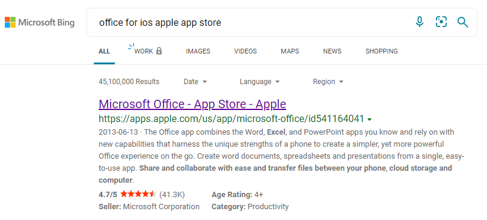
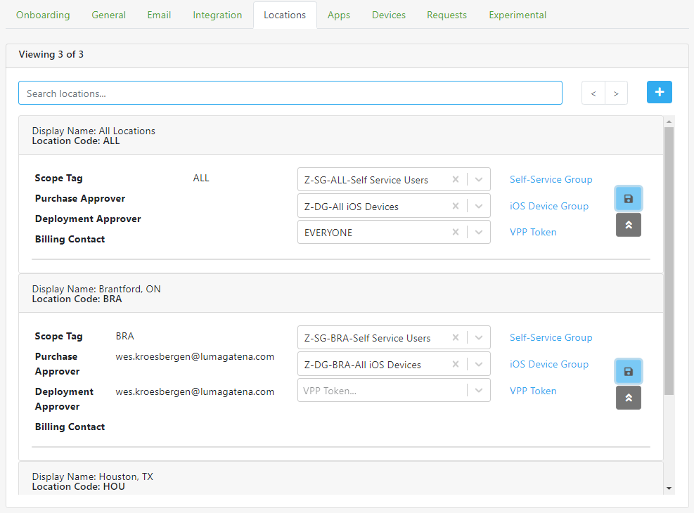

MovoSuite for Microsoft Intune delivers a simple, powerful self-service experience for deploying apps to classroom iPads.

## Table of Contents

- [Install and Configuration Checklist](#install-and-configuration-checklist)
- [Prerequisites](#prerequisites)
- [Home Screen](#home-screen)
- [Request Deployment](#request-deployment)
- [Request App](#request-app)
- [Configuration](#configuration)
  - [Onboarding](#onboarding)
  - [General](#general)
  - [Email](#email)
  - [Integration (bulk admin)](#integration-import-export-bulk-admin)
  - [Locations](#locations)
  - [Apps](#apps)
  - [Devices](#devices)
  - [Requests](#requests)
  - [Experimental](#experimental)

## Install and Configuration Checklist<!-- omit in toc -->

The following is a high-level implementation checklist for MovoSuite, with links to detailed steps for each item on the list. 

*To configure MovoSuite, 1) click the task's link, 2) complete the steps, then 3) click the "return to checklist" link to return to this checklist.*

- **Step 1: Complete and verify the prerequisites**. Full list of prerequisites [HERE](#prerequisites).
- **Step 2: Complete the Onboarding Wizard**. Step-by-step instructions [HERE](#onboarding).
- **Step 3: Authorize MovoSuite to query Intune on behalf of your users**. [HERE](#onboarding) As a Directory Admin (Global Admin), click 'Authorize Users' under the Step 1 heading. This authorizes MovoSuite to query Intune apps and devices on behalf of your users.
- **Step 4: Authorize MovoSuite to process requests, send notifications, automate app group assignments, and update app and device lists from Intune**. [HERE](#onboarding) As a Directory Admin (Global Admin), click 'Authorize Automation' under the Step 2 heading. This authorizes MovoSuite to work with Intune via Microsoft Graph in the background. You may be prompted to grant MovoSuite to access your directory as you to perform this step.
- **Step 5: Configure sender email address**. [HERE](#email) Enter your sender email address in the Sender Address field.The address from which emails are sent.
- **Step 6: Configure notification email addresses**. [HERE](#email) Enter your notification email addresses in the Notifications area
- **Step 7: Configure Actionable (live) emails**. [HERE](#generate-the-office-365-originator-id) Navigate to the Email tab in configuration, and click 'Create Originator ID' under the Actionable Emails section. Create a new Provider ID named 'MovoSuite' using the details specified in the Actionable Emails area.
- **Step 8: Test MovoSuite Functionality**. [HERE](#) Try deploying an app to one of your devices, and test the purchase form.

[back to ToC](#table-of-contents)

## Prerequisites<!-- omit in toc -->

Before configuring MovoSuite, you should have the following items in place.

- **#1 - Contributor rights to an Azure subscription or Resource Group**. Have at least Contributor rights to an Azure subscription or Resource Group within the subscription.
- **#2 - Have access to a Global Administrator account**. The Global Administrator account is used for authorizing MovoSuite to perform deployment and notification actions, as well as approving Office 365 Provider ID (also known as Originator ID). If you do not have access to a Global Administrator account, you will need access to accounts with at least:
  - The ability to consent to an application for delegated and application permissions. [See here](https://docs.microsoft.com/en-us/azure/active-directory/roles/custom-consent-permissions) for more information on creating a custom role to do this.
  - Exchange Administrator role for approving the Provider / Originator ID.
- **#3 - Intune with DEP and VPP integrated**. MovoSuite builds on and enhances native Intune functionality, so you will need Intune deployed integrated with your Apple Device Enrollment Program (DEP) and Volume Purchase Plan (VPP). MovoSuite supports unlimited VPP tokens up to the Intune maximum.
- **#4 - Create an Exchange Online mailbox for sending email notifications**. This should be a User Mailbox (requires an account with an Exchange Online license) or a Shared Mailbox (no license required), but cannot be an Office 365 Group mailbox due to limitations in Microsoft Graph today.
- **#5 - Identify an email address for receiving notifications/requests**. Ideally, this should be an **Office 365 Group**, with members subscribed to emails in order for Actionable (live) emails to work. Shared/resource mailboxes will not render the Actionable emails, and fall back to basic HTML). Alternatively, specify an individual user email address.

[back to ToC](#table-of-contents) | [back to checklist](#install-and-configuration-checklist)

## Home Screen<!-- omit in toc -->

**FIGURE X**. MovoSuite Home

[back to ToC](#table-of-contents) | [back to checklist](#install-and-configuration-checklist)

## Request Deployment<!-- omit in toc -->

*To request deployment of one more apps to one more devices, perform the following steps:*

1. Navigate to **Request Deployment**.

**FIGURE X**. Deployment Request UI

2. Click the **Choose Apps** button.
3. In the modal dialog that pops up, under **Available Apps** click the **+** button next to the app(s) that you wish to deploy. This moves them across to the **Selected Apps** field. Note the indicators for whether an app requires deployment approval or billing code.

**FIGURE X**. Choose Apps Modal

3. Click **Save** to save your selection and go back to the main form.
4. Click the **Choose Devices** button.
5. In the modal dialog that pops up, under **Available Devices** click the **+** button next to the device(s) to which you wish to deploy your apps. This moves them across to the **Selected Devices** field.

**FIGURE X**. Choose Devices Modal

6. Click **Save** to save your selection and go back to the main form.
7. Modify your **Deployment Action** from the default Install if you wish to uninstall apps from the selected devices.
8. Modify your **Deployment Notifications** from the default if you don't wish to receive all email notifications related to this request.

9. Enter information in the **Reason for Request** field if it is required.
10. Enter information in the **Billing Code** field if it is visible and required (this field can be hidden by the administrator).

**FIGURE X**. Completed Deployment Form

11. Click **Submit** to submit the form and be redirected to the home page. The request list will be updated to add your latest request.
12. At this point you will receive an acknowledgement email that your request has been received and is being processed. As the request is processed, if your administrator has enabled the Actionable email functionality, and you are using a current version of Outlook (desktop or mobile), the email will automatically update with the latest status every time you view it.
13. Once the request is fully processed (all apps have been approved / declined if any required approval), you will receive an email notification that the request is completed. Your apps should show up within about 20 minutes of the final notification, if not earlier.

[back to ToC](#table-of-contents) | [back to checklist](#install-and-configuration-checklist)

## Request App<!-- omit in toc -->

*To request your administrator procure an application license from Apple for deployment to devices, perform the following steps:*

1. Navigate to **Request App**.

**FIGURE X**. New App Request Form

2. Using the search engine of your choice, find the Apple App Store URL for the iOS app you wish to deploy. Paste the URL into the URL field of the form.

**FIGURE X**. Apple App Store URL via search link

3. Choose the number of licenses you want your administrator to procure.
4. Enter information in the **Billing Code** field if it is visible and required (this field can be hidden by the administrator).
5. Enter any additional comments in the **Comments** field as to why you want to purchase these apps.

**FIGURE X**. Completed Request App form

6. Click **Submit** to submit your request.
7. At this point you will receive an acknowledgement email that your request has been received.

[back to ToC](#table-of-contents) | [back to checklist](#install-and-configuration-checklist)

## Configuration<!-- omit in toc -->

The Configuration tab includes the settings that will be visible only to MovoSuite administrators, generally the same person responsible for Intune configuration in your environment. 

[back to ToC](#table-of-contents) | [back to checklist](#install-and-configuration-checklist)

### Onboarding<!-- omit in toc -->

*To complete the MovoSuite onboarding process, perform the following steps:*

1. Navigate to **Configuration**, and select the **Onboarding** tab.
2. First, click the **Authorize for Users** button, and when prompted, click **Accept**. This authorizes MovoSuite to query Intune apps and devices on behalf of your users.
3. Next, click the **Authorize Automation** button, and when prompted, click **Accept**. This authorizes MovoSuite to work with Intune and Azure AD in the background.

**FIGURE X**. Onboarding Wizard

[back to ToC](#table-of-contents) | [back to checklist](#install-and-configuration-checklist)

### General<!-- omit in toc -->

**FIGURE X**. Configuration - General

#### Self Service<!-- omit in toc -->

Enable App Catalog Procurement Form

Require Exact Match for Device Lookup

##### Enable RBAC

When you check the Enable RBAC box under **Configuration \> General**, you can then add users to Azure AD roles created out-of-the-box for and by MovoSuite. MovoSuite roles in Azure AD are:

- **Self-Service User**. This user will be able to deploy apps, but will NOT see the **Configuration** tab in MovoSuite.
- **Administrator**. Users in this role have full permissions in MovoSuite, and see all MovoSuite settings

To add user or group to MovoSuite roles in Azure Active Directory:

**FIGURE X**. Adding Users or Groups to MovoSuite RBAC Roles

Enable Self-Service Tags and Groups

Enable Field Tech Tags and Groups

User Two Stage Approval

Hide Billing Code

Billing Code Placeholder

Timezone

#### Other<!-- omit in toc -->

#### Admin Group<!-- omit in toc -->

#### Apple App Store Country Code<!-- omit in toc -->

#### Group Name Prefixes<!-- omit in toc --> 

[back to ToC](#table-of-contents) | [back to checklist](#install-and-configuration-checklist)

### Email<!-- omit in toc -->

*To X, perform the following steps:*

There are three email addresses for backend administrative items. You may use an email-enabled group address for any of these notifications, shown in the figure below.

**FIGURE X**. E-mail Notification and Message Format

#### E-mail Templates <!-- omit in toc -->

Configuring your email templates is a simple 2-step process:

**STEP 1: Select the Action**: Select the action for which you wish to configure the e-mail template, shown in Figure X and described in the list below.

**FIGURE X**. Email Template task selection

- **App Request Received**. When a user requests an app that requires Admin approval, and clicks **Submit Request**, they will receive a message confirming their request was received.
- **Deployment Approval Request**. When a user requests an app that requires Admin approval, these settings will format the approval request e-mail to the email-enabled group you specify in the Email Notifications section.
- **Deployment Completed**. When the deployment request is complete, this message will be sent to the requesting user.
- **Deployment Started**. When an app deployment begins, this message will be sent to the email address of the user requesting deployment.
- **Purchase Request Approval**. When a user requests a new app to be purchased and added to their catalog, this message will be sent to the **Procurement Requests** email address.
- **Purchase Request Completed**. When someone at the **Procurement Requests** email address completes the app purchase and marks the request as complete.

**STEP 2: Customize the Template**: The default template for that function you chose will be presented right below the list, as shown in Figure X, Customize the template customize using free text and variables shown at the bottom of the template. Supported variables are:

| Variable | Description  |
|----------|-----------------------|
|  %appName  | Display name of the app referenced in the request.   |
|  %requestId  |  The ID number of the request  |
|  %requestStatus  | Status the request (e.g. In progress, Complete, Failed)  |

**IMPORTANT**: Click **Save** to save your changes to the template you are working with BEFORE choosing another!

**FIGURE X**. Email Template configuration area

[back to ToC](#table-of-contents) | [back to checklist](#install-and-configuration-checklist)

> **Note**: MovoSuite sends a command for each device after approval and initial batch of non-approved apps, rather than waiting for the devices to report back before sending the email. The message is sent only after the last app in the list has been provided.  

#### Generate the Office 365 Originator ID<!-- omit in toc -->

While still in the Email configuration area, we will generate the Office 365 Provider (Originator) ID. This establishes a trust foundation for Outlook to fetch the latest information for the email from MovoSuite for notifications related to app approval and app procurement workflows. 

1. You will click the Create ID button. This will take you to the [**Actionable Email Developer Dashboard**](https://outlook.office.com/connectors/oam/publish) where you can generate this ID. You will need the three items listed under the textbox in Figure 17. 

    

    Figure X. The Office 365 Originator ID

2. You will now provide answers to the following items:

   2.1. **New Provider**:
      - Friendly Name: MovoSuite
      - Sender email address: _**the sender email address from Actionable Emails section (unchangeable)**_
      - Provider URL: _**target URL from Actionable Emails section**_

   2.2. **Scope of submission**: Organization

   2.3. **Additional Information**:
      - Other email addresses: Email addresses of others who should be notified about MovoSuite license renewal. 
      - Comments: "Email notifications from MovoSuite for Intune"

3. At the bottom of the form, check the box labeled "I accept the terms and conditions…" and then click Save.
4. Once you have generated the ID, an email notification will be sent to the Exchange administrators of your organizations to approve. If you are a Global Administrator or Exchange Administrator, you can approve the pending ID from the admin view of the **Actionable Email Developer Dashboard** [here](https://https://outlook.office.com/connectors/oam/admin).
5. Save the **Provider ID (originator)** from the **Actionable Email Developer Dashboard** into MovoSuite, and save the change.

[back to ToC](#table-of-contents) | [back to checklist](#install-and-configuration-checklist)

### Integration (bulk admin)<!-- omit in toc -->

The Integration Settings area of the MovoSuite interface includes:\

- **Intune Service Account**. This hosts the service account MovoSuite will use to connect to your Intune instance. 
- **Naming Standards**. This feature automates naming of shared iPads in Intune using the device naming format you specify.
- Asset Management. This feature enables ingestion of shared iPad devices directly from service desk, Excel, or SQL data sources.  

Configuration steps for these features are detailed below.

*To X, perform the following steps:*

**FIGURE X**. Asset Integration and Data Ingestion

[back to ToC](#table-of-contents) | [back to checklist](#install-and-configuration-checklist)

### Locations<!-- omit in toc -->

*To X, perform the following steps:*

**FIGURE X**. Location Group and VPP Configuration

[back to ToC](#table-of-contents) | [back to checklist](#install-and-configuration-checklist)

### Apps<!-- omit in toc -->

*To X, perform the following steps:*

**FIGURE X**. App Settings Configuration

[back to ToC](#table-of-contents) | [back to checklist](#install-and-configuration-checklist)

### Devices<!-- omit in toc -->

*To X, perform the following steps:*

**FIGURE X**. Device Location Assignment

[back to ToC](#table-of-contents) | [back to checklist](#install-and-configuration-checklist)

### Requests<!-- omit in toc -->

*To X, perform the following steps:*

**FIGURE X**. Deployment Request History

[back to ToC](#table-of-contents) | [back to checklist](#install-and-configuration-checklist)

### Experimental<!-- omit in toc -->

*To X, perform the following steps:*

**FIGURE X**. Experimental Feature Enablement

[back to ToC](#table-of-contents) | [back to checklist](#install-and-configuration-checklist)

### TO-DO<!-- omit in toc -->

*How do we assign a user a catalog specific to their location?*
e.g. - A catalog for teachers at school X.

*Which tasks do you expect users will be least able or totally unable to do on their own?*

*What if I don't configure RBAC?*
Just use the Admin group

*Where did Device Name Format go? (General tab)*
Now on the integration tab, configurable per-location

*Spreadsheet template for the Excel import?*
Docs have enough guidance on this I think.