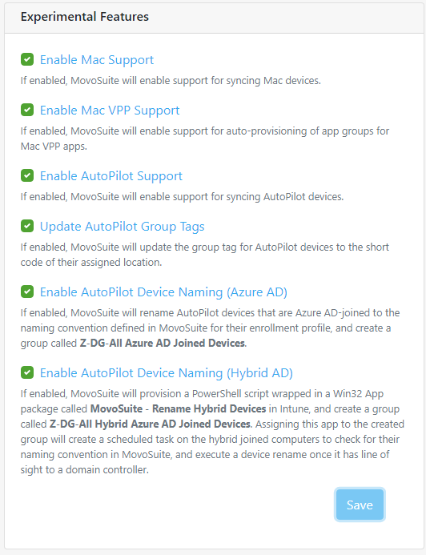

MovoSuite for Microsoft Intune delivers a simple, powerful self-service experience for deploying apps to classroom iPads.

## Table of Contents

- [Install and Configuration Checklist](#install-and-configuration-checklist)
- [Prerequisites](#prerequisites)
- [Home Screen](#home-screen)
- [Request Deployment](#request-deployment)
- [Request App](#request-app)
- [Configuration](#configuration)
  - [Onboarding](#onboarding)
  - [General](#general)
  - [Email](#email)
  - [Integration](#integration)
  - [Locations](#locations)
  - [Apps](#apps)
  - [Devices](#devices)
  - [Requests](#requests)
  - [Experimental](#experimental)

## Install and Configuration Checklist<!-- omit in toc -->

The following is a high-level implementation checklist for MovoSuite, with links to detailed steps for each item on the list. 

*To configure MovoSuite, 1) click the task's link, 2) complete the steps, then 3) click the "return to checklist" link to return to this checklist.*

- **Step 1: Complete and verify the prerequisites**. Full list of prerequisites [HERE](#prerequisites).
- **Step 2: Complete Onboarding Wizard**. Step-by-step instructions [HERE](#onboarding).
- **Step 3: Authorize MovoSuite to query Intune**. [HERE](#) As a Directory Admin (Global Admin), click 'Authorize Users' under the Step 1 heading. This authorizes MovoSuite to query Intune apps and devices on behalf of your users.
- **Step 4: Authorize MovoSuite for automation**. [HERE](#) As a Directory Admin (Global Admin), click 'Authorize Automation' under the Step 2 heading. This authorizes MovoSuite to work with Intune and Azure AD in the background.
- Step 5: Navigate to the Email tab in Configuration. Click 'Create Originator ID' under the Actionable Emails field. Create a new Provider ID named 'MovoSuite' using the parameters specified in the Actionable Emails area.
- **Step 6: Sender email address**. [HERE](#) Enter your sender email address in the Sender Address field.The address from which emails are sent.
- **Step 7: Notification email address**. [HERE](#email) Enter your notification email addresses in the Notifications area
- **Step 8: Test MovoSuite Functionality**. [HERE](#) Deploy an app to one of your devices.

[back to ToC](#table-of-contents)

## Prerequisites<!-- omit in toc -->

Before configuring MovoSuite, you should have the following items in place.

- **#1 - Intune with DEP and VPP integrated**. MovoSuite builds on and enhances native Intune functionality, so you will need Intune deployed integrated with your Apple Device Enrollment Program (DEP) and Volume Purchase Plan (VPP). MovoSuite supports unlimited VPP tokens up to the Intune maximum (currently 256).
- **#2 Create an Office 365 email account for sending email**. This account only needs an Exchange Online mailbox. It should be a user account mailbox, not a resource mailbox due to limitations in Microsoft Graph today.
- **#3 Identify an email address for sending notifications/requests to**. Ideally, this should be an **Office 365 Group email address**, with members subscribed to emails in order for Actionable (Live) emails to work. Shared/resource mailboxes will not render the Actionable emails, and fall back to basic HTML). Alternatively, specify an individual user email address.

[back to ToC](#table-of-contents) | [back to checklist](#install-and-configuration-checklist)

## Home Screen<!-- omit in toc -->

**FIGURE X**. MovoSuite Home

[back to ToC](#table-of-contents) | [back to checklist](#install-and-configuration-checklist)

## Request Deployment<!-- omit in toc -->

*To X, perform the following steps:*

**FIGURE X**. Deployment Request UI

[back to ToC](#table-of-contents) | [back to checklist](#install-and-configuration-checklist)

## Request App<!-- omit in toc -->

*To X, perform the following steps:*

**FIGURE X**. New App Request Form

[back to ToC](#table-of-contents) | [back to checklist](#install-and-configuration-checklist)

## Configuration<!-- omit in toc -->

The Configuration tab includes the settings that will be visible only to MovoSuite administrators, generally the same person responsible for Intune configuration in your environment. 

[back to ToC](#table-of-contents) | [back to checklist](#install-and-configuration-checklist)

### Onboarding<!-- omit in toc -->

*To complete the MovoSuite onboarding process, perform the following steps:*

1. Navigate to **Configuration**, and select the **Onboarding** tab.
2. First, click the **Authorize for Users** button, and when prompted, click **Accept**. This authorizes MovoSuite to query Intune apps and devices on behalf of your users.
3. Next, click the **Authorize Automation** button, and when prompted, click **Accept**. This authorizes MovoSuite to work with Intune and Azure AD in the background.

**FIGURE X**. Onboarding Wizard

[back to ToC](#table-of-contents) | [back to checklist](#install-and-configuration-checklist)

### General<!-- omit in toc -->

**FIGURE X**. Configuration - General

[back to ToC](#table-of-contents) | [back to checklist](#install-and-configuration-checklist)

### Email<!-- omit in toc -->

*To X, perform the following steps:*

There are three email addresses for backend administrative items. You may use an email-enabled group address for any of these notifications, shown in the figure below.

**FIGURE X**. E-mail Notification and Message Format

#### E-mail Templates <!-- omit in toc -->

There are six email addresses for backend administrative items. You may use an email-enabled group address for any of these notifications. Configuring your email templates is a simple 2-step process:

**STEP 1**: Select the action you wish to configure shown in Figure X and described in the list below.

**FIGURE X**. Email Template task selection

- **App Request Received**. When a user requests an app that requires Admin approval, and clicks **Submit Request**, they will receive a message confirming their request was received.
- **Deployment Approval Request**. When a user requests an app that requires Admin approval, these settings will format the approval request e-mail to the email-enabled group you specify in the Email Notifications section.
- **Deployment Completed**. When the deployment request is complete, this message will be sent to the requesting user.
- **Deployment Started**. When an app deployment begins, this message will be sent to the email address of the user requesting deployment.
- **Purchase Request Approval**. When a user requests a new app to be purchased and added to their catalog, this message will be sent to the **Procurement Requests** email address.
- **Purchase Request Completed**. When someone at the **Procurement Requests** email address completes the app purchase and marks the request as complete.

**STEP 2**: The default template for that function you chose will be presented right below the list, as shown in Figure X, Customize the template customize using free text and variables shown at the bottom of the template. Supported variables are:

| Variable | Description  |
|----------|-----------------------|
|  %appName  | Display name of the app referenced in the request.   |
|  %requestId  |  The ID number of the request  |
|  %requestStatus  | Status the request (e.g. In progress, Complete, Failed)  |

**FIGURE X**. Email Template configuration area

[back to ToC](#table-of-contents) | [back to checklist](#install-and-configuration-checklist)

> **Note**: MovoSuite sends a command for each device after approval and initial batch of non-approved apps, rather than waiting for the devices to report back before sending the email. The message is sent only after the last app in the list has been provided.  

#### Generate the Office 365 Originator ID<!-- omit in toc -->

While still in the Email Notifications section, we will generate the Office 365 Originator ID. This establishes the foundation for how MovoSuite will send notifications related to app approval and app procurement workflows. 

1. You will click the Create ID button. This will take you to the “Actionable Email Developer Dashboard” screen in the Azure portal where you can generate this ID. You will need the three items listed under the textbox in Figure 17. 

    

    Figure X. The Office 365 Originator ID

2. You will now provide answers to the following items:
  a. New Provider
      - Friendly Name: MovoSuite
      - Sender email address: <static, email-enabled group address>
      - Provider URL: \<Target URL from Office 365 Originator ID section>
  b. Scope of submission: Organization
  c. Additional Information:
      - Other email addresses: Email addresses of others who should be notified about MovoSuite license renewal. 
      - Comments: “Setting up email notifications from MovoSuite for MS Intune”
3. At the bottom of the form, check the box labeled “I accept the terms and conditions…” and then click Save.

[back to ToC](#table-of-contents) | [back to checklist](#install-and-configuration-checklist)

### Integration<!-- omit in toc -->

The Integration Settings area of the MovoSuite interface includes:\

- **Intune Service Account**. This hosts the service account MovoSuite will use to connect to your Intune instance. 
- **Naming Standards**. This feature automates naming of shared iPads in Intune using the device naming format you specify.
- Asset Management. This feature enables ingestion of shared iPad devices directly from service desk, Excel, or SQL data sources.  

Configuration steps for these features are detailed below.

*To X, perform the following steps:*

**FIGURE X**. Asset Integration and Data Ingestion

[back to ToC](#table-of-contents) | [back to checklist](#install-and-configuration-checklist)

### Locations<!-- omit in toc -->

*To X, perform the following steps:*

**FIGURE X**. Location Group and VPP Configuration

[back to ToC](#table-of-contents) | [back to checklist](#install-and-configuration-checklist)

### Apps<!-- omit in toc -->

*To X, perform the following steps:*

**FIGURE X**. App Settings Configuration

[back to ToC](#table-of-contents) | [back to checklist](#install-and-configuration-checklist)

### Devices<!-- omit in toc -->

*To X, perform the following steps:*

**FIGURE X**. Device Location Assignment

[back to ToC](#table-of-contents) | [back to checklist](#install-and-configuration-checklist)

### Requests<!-- omit in toc -->

*To X, perform the following steps:*

**FIGURE X**. Deployment Request History

[back to ToC](#table-of-contents) | [back to checklist](#install-and-configuration-checklist)

### Experimental<!-- omit in toc -->

*To X, perform the following steps:*

**FIGURE X**. Experimental Feature Enablement

[back to ToC](#table-of-contents) | [back to checklist](#install-and-configuration-checklist)