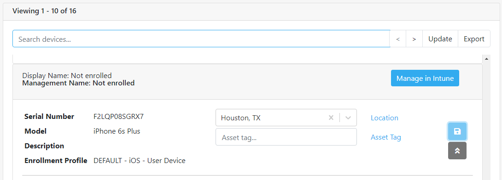

### Devices<!-- omit in toc -->

The Devices area in MovoSuite configuration shows you the devices recorded in MovoSuite, and allows you to (re)assign a device to a location. Assigning a device to a location will update the name of the device on the next rename cycle if applicable.

Clicking the Expand button on a device in the Devices list will show you additional details for the device, including the Intune and Azure AD object IDs. You can also add / modify asset tag and management notes.

To export the Devices list to Excel, click Export above the scroll bar on the right.

**FIGURE 22**. Device List

[back to ToC](../README.md) \| [back to Configuration](./README.md)