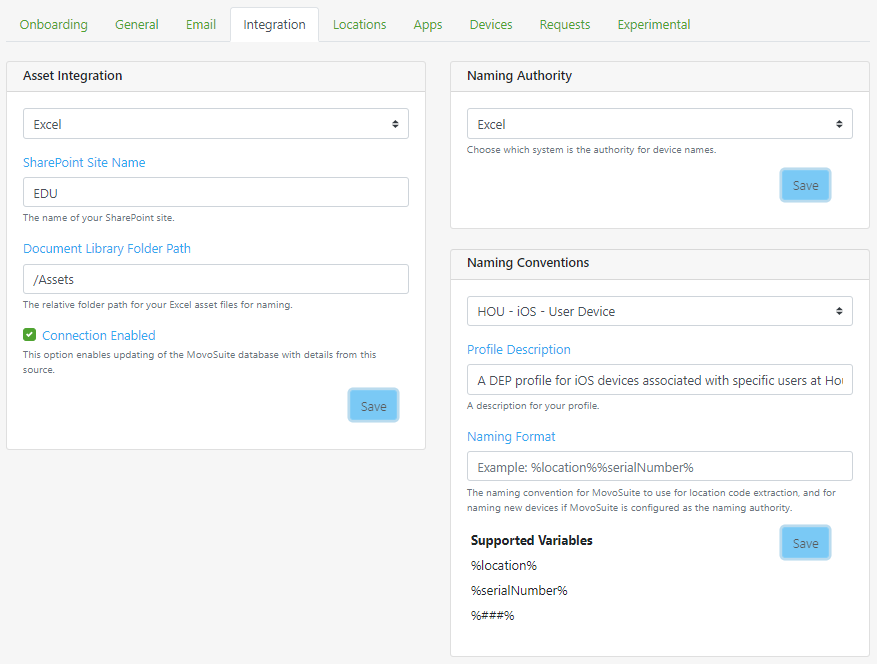

### Integration (bulk admin)<!-- omit in toc -->

The Integration Settings area of the MovoSuite interface includes:

- **Asset Integration**. This feature enables ingestion of additional information (such as asset tag numbers for matching serial numbers) for shared iPad devices directly from service desk or Excel data sources.  
- **Naming Authority**. This feature enables automated naming of shared iPads in Intune using the device naming format you specify under **Naming Conventions**.
- **Naming Conventions**. This feature enables customization of the naming of shared iPads in Intune, including location short codes or asset tag numbers. The naming conventions are defined on a per DEP profile or per AutoPilot profile basis, with support for variables for the short code for the device **location**, **asset tag** (if the device asset tag fields are populated), or **serial number**. If naming conventions are defined with a location variable, MovoSuite will attempt to extract the location code from device name for devices that aren't already assigned to a location.

**FIGURE 19**. Asset Integration and Data Ingestion

#### Excel Import<!-- omit in toc -->

MovoSuite supports the following column values for Excel import and device naming. A sample template can be downloaded from [here](https://github.com/lumagateinc/MovoSuite/blob/master/samples/AssetsForImport.xlsx).

| Column Name				| Purpose							|
|---------------------------|-----------------------------------|
| Serial Number				| The serial number to match on. 	|
| Device Name				| The desired display name for the device. |
| Grades					| **Optional.** A backslash delimited list of grades this device is assigned to, e.g. 'K\1\2'.	|
| Room						| **Optional.** The room this device is assigned to.	|
| Location Code				| **Optional.** The short code of the location this device is assigned to. |
| Device Groups				| **Optional.** A backslash delimited list of device groups this device belongs to, e.g. 'Cart 1\Loaner Pool'. Requires the device is also assigned to a location as the device groups are bound to the location.	|
| Staff						| **Optional, currently unused.** A *1* or a *0* indicating whether this device is a staff device (*1* = yes).	|
| Student					| **Optional, currently unused.** A *1* or a *0* indicating whether this device is a student device (*1* = yes).	|
| Asset Tag					| **Optional.** The asset tag for this device.	|

For the Excel Import, MovoSuite has two additional flags: 
- **Auto-create Missing Locations**. Enable this to automatically create locations if their short codes are missing from MovoSuite.
- **Auto-create Missing Groups**. Enable this to automatically create device groups if a device is assigned to a group that's not yet created for the location.

[back to ToC](#table-of-contents) \| [back to checklist](#install-and-configuration-checklist)