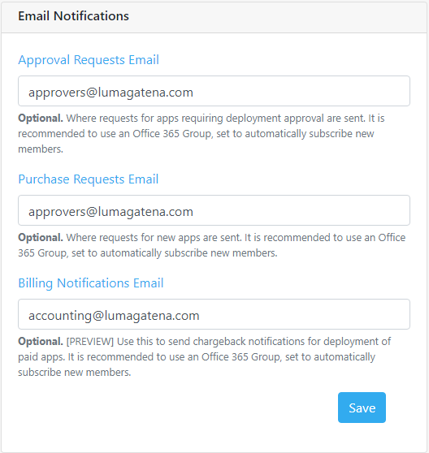

### Notifications<!-- omit in toc -->

*To configure notifications, perform the following steps:*
1. Configure Sender Email Address
2. Configure Approval Recipient Email addresses
3. Configure Office 365 Provider ID
4. **Optional**: Configure Webhook Notifications For Microsoft Teams

#### Notifications Sender Email<!-- omit in toc -->

Configure the Sender Email address field with the email address of a User Mailbox or Shared Mailbox existing in Exchange Online. Office 365 Group Mailboxes cannot be used for the sender address.

 

**FIGURE 12**. Sender Email Address

#### Notifications Recipient Emails<!-- omit in toc -->

There are three email addresses for backend administrative items. You may use an email-enabled group address for any of these notifications, shown in the figure below.

 

**FIGURE 13**. E-mail Notification and Message Format

#### Webhook Notifications<!-- omit in toc -->

You can configure notification of approval requests (deployment or purchase) to Microsoft Teams via webhook. These notifications are actionable, which means you can approve or decline the approval request right within your Teams channel!

To configure actionable webhook notifications:

1. Open Microsoft Teams and select the team you would like to receive notifications.
2. Click the ellipsis (...) next to the team name and select **Manage team**.
3. Select the **Apps** tab.
4. If you do not see webhooks in the list, click the **More apps** button.
5. In the search box , type 'webhook'. From the search results, select 'Incoming Webhook' and click the **Add to a team** button.
6. On the 'Setup an incoming Webhook...', click the **Setup a connector** button.
7. On the Incoming Webhook screen, click **Create**. Then, copy the URL, as shown in the figure below.

**FIGURE 14**. Webhook URL in Teams

8. To complete the configuration, go back to the **Configuration > Email** tab of MovoSuite.
9. Paste the URL from step 7 into one or both fields provided in the 'Webhook Notifications' area.
10. Click the **Save** button at the bottom of the screen to save your changes.

**FIGURE 15**. Webhook Notifications configuration

[back to ToC](../README.md)

#### E-mail Templates <!-- omit in toc -->

Configuring your email templates is a simple 2-step process:

**STEP 1: Select the Action**: Select the action for which you wish to configure the e-mail template, shown in Figure X and described in the list below.

**FIGURE 16**. Email Template task selection

- **App Request Received**. When a user requests an app that requires Admin approval, and clicks **Submit Request**, they will receive a message confirming their request was received.
- **Deployment Approval Request**. When a user requests an app that requires Admin approval, these settings will format the approval request e-mail to the email-enabled group you specify in the Email Notifications section.
- **Deployment Completed**. When the deployment request is complete, this message will be sent to the requesting user.
- **Deployment Started**. When an app deployment begins, this message will be sent to the email address of the user requesting deployment.
- **Purchase Request Approval**. When a user requests a new app to be purchased and added to their catalog, this message will be sent to the **Procurement Requests** email address.
- **Purchase Request Completed**. When someone at the **Procurement Requests** email address completes the app purchase and marks the request as complete.

**STEP 2: Customize the Template**: The default template for that function you chose will be presented right below the list, as shown in Figure X, Customize the template customize using free text and variables shown at the bottom of the template. Supported variables are:

| Variable | Description  |
|----------|-----------------------|
|  %appName  | Display name of the app referenced in the request.   |
|  %requestId  |  The ID number of the request  |
|  %requestStatus  | Status the request (e.g. In progress, Complete, Failed)  |

**IMPORTANT**: Click **Save** to save your changes to the template you are working with BEFORE choosing another!

**FIGURE 17**. Email Template configuration area

[back to ToC](../README.md) \| [back to checklist](#install-and-configuration-checklist)

> **Note**: MovoSuite sends a command for each device after approval and initial batch of non-approved apps, rather than waiting for the devices to report back before sending the email. The message is sent only after the last app in the list has been provided.  

#### Generate the Office 365 Provider ID<!-- omit in toc -->

While still in the Email configuration area, we will generate the Office 365 Provider (Originator) ID. This establishes a trust foundation for Outlook to fetch the latest information for the email from MovoSuite for notifications related to app approval and app procurement workflows. 

1. You will click the **Create Provider ID** button. This will take you to the [**Actionable Email Developer Dashboard**](https://outlook.office.com/connectors/oam/publish) where you can generate this ID. You will need the three items listed under the textbox in Figure 17. 

    

    Figure 18. The Office 365 Provider ID

2. You will now provide answers to the following items:

   2.1. **New Provider**:
      - Friendly Name: MovoSuite
      - Sender email address: _**the sender email address from Actionable Emails section (unchangeable)**_
      - Provider URL: _**target URL from Actionable Emails section**_

   2.2. **Scope of submission**: Organization

   2.3. **Additional Information**:
      - Other email addresses: Email addresses of others who should be notified about MovoSuite license renewal. 
      - Comments: "Email notifications from MovoSuite for Intune"

3. At the bottom of the form, check the box labeled "I accept the terms and conditions…" and then click Save.
4. Once you have generated the ID, an email notification will be sent to the Exchange administrators of your organizations to approve. If you are a Global Administrator or Exchange Administrator, you can approve the pending ID from the admin view of the **Actionable Email Developer Dashboard** [here](https://https://outlook.office.com/connectors/oam/admin).
5. Save the **Provider ID (originator)** from the **Actionable Email Developer Dashboard** into MovoSuite, and save the change.

[back to ToC](../README.md) \| [back to Configuration](./README.md)