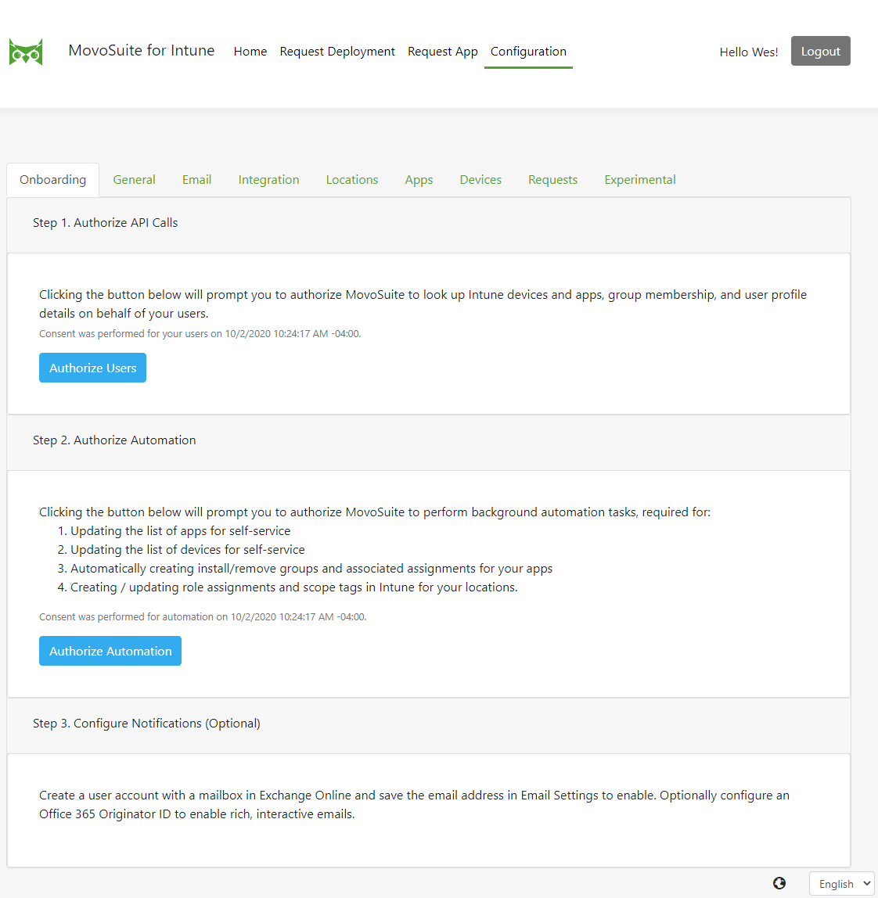

### Onboarding

*To complete the MovoSuite onboarding process, perform the following steps:*

1. Navigate to **Configuration**, and select the **Onboarding** tab.
2. First, click the **Authorize for Users** button, and when prompted, click **Accept**. This authorizes MovoSuite to query Intune apps and devices on behalf of your users.
3. Next, click the **Authorize Automation** button, and when prompted, click **Accept**. This authorizes MovoSuite to work with Intune and Azure AD in the background.

**FIGURE 9**. Onboarding Wizard

[back to ToC](#table-of-contents) \| [back to checklist](#install-and-configuration-checklist)