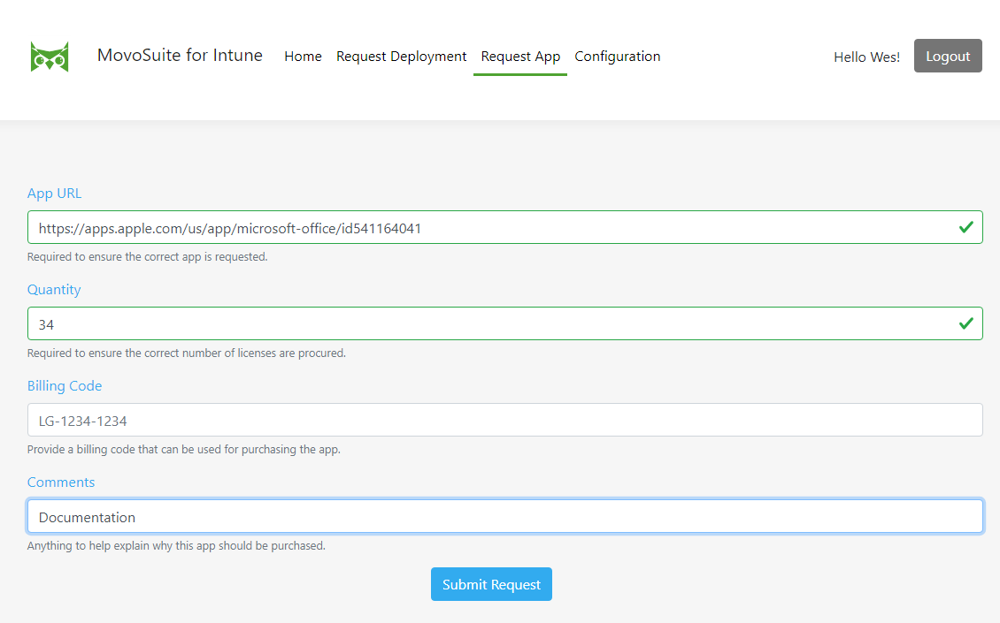

## Request App

*To request your administrator procure an application license from Apple for deployment to devices, perform the following steps:*

1. Navigate to **Request App**.

**FIGURE 6**. New App Request Form

2. Using the search engine of your choice, find the Apple App Store URL for the iOS app you wish to deploy. Paste the URL into the URL field of the form.

**FIGURE 7**. Apple App Store URL via search link

3. Choose the number of licenses you want your administrator to procure.
4. Enter information in the **Billing Code** field if it is visible and required (this field can be hidden by the administrator).
5. Enter any additional comments in the **Comments** field as to why you want to purchase these apps.

**FIGURE 8**. Completed Request App form

6. Click **Submit** to submit your request.
7. At this point you will receive an acknowledgement email that your request has been received.

[back to ToC](../README.md) \| [back to Self-Service](./README.md)