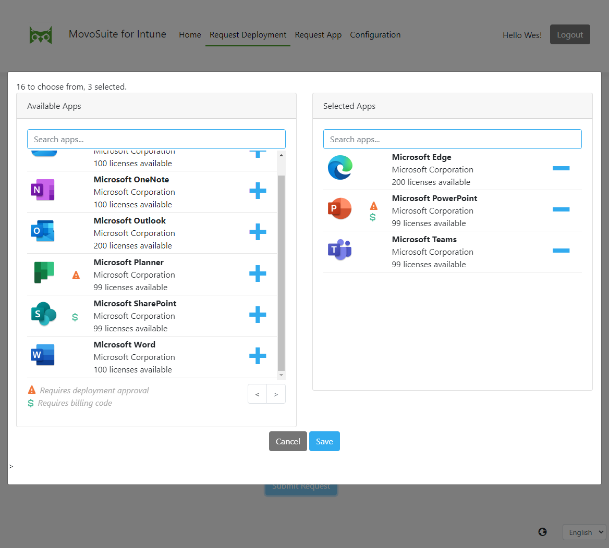
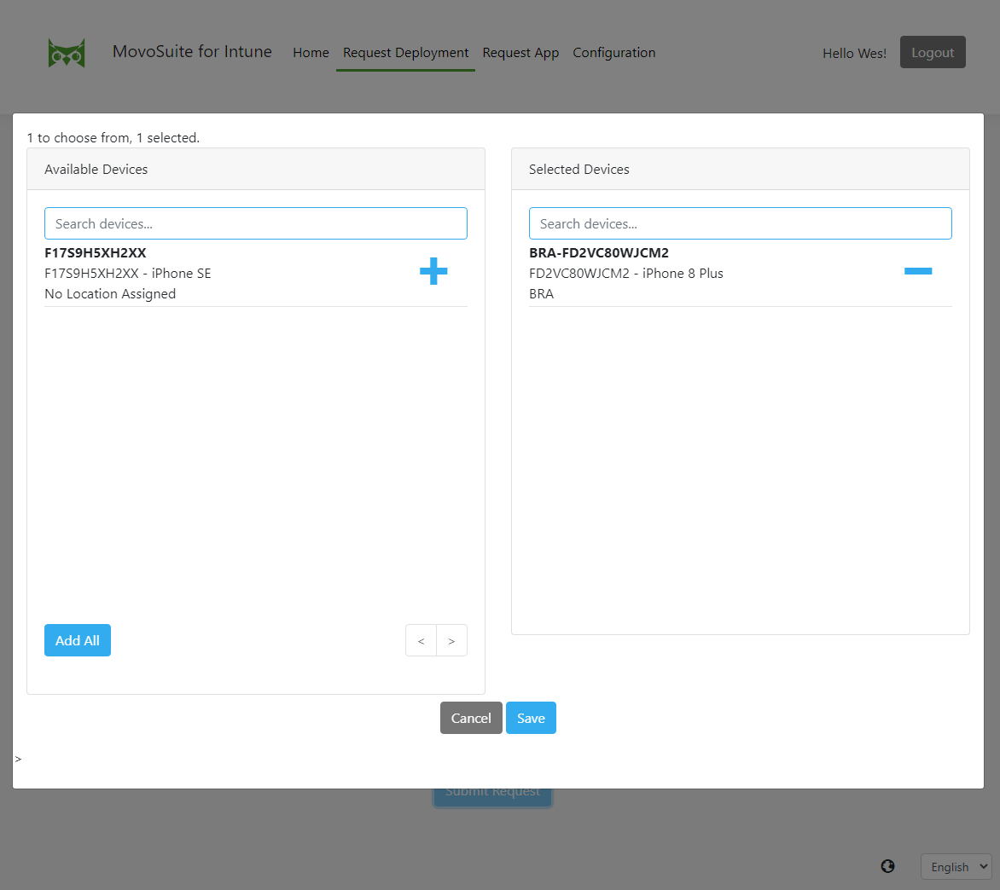

## Request Deployment

*To request deployment of one more apps to one more devices, perform the following steps:*

1. Navigate to **Request Deployment**.

**FIGURE 2**. Deployment Request UI

2. Click the **Choose Apps** button.
3. In the modal dialog that pops up, under **Available Apps** click the **+** button next to the app(s) that you wish to deploy. This moves them across to the **Selected Apps** field. Note the indicators for whether an app requires deployment approval or billing code.

**FIGURE 3**. Choose Apps Modal

3. Click **Save** to save your selection and go back to the main form.
4. Click the **Choose Devices** button.
5. In the modal dialog that pops up, under **Available Devices** click the **+** button next to the device(s) to which you wish to deploy your apps. This moves them across to the **Selected Devices** field.

**FIGURE 4**. Choose Devices Modal

6. Click **Save** to save your selection and go back to the main form.
7. Modify your **Deployment Action** from the default Install if you wish to uninstall apps from the selected devices.
8. Modify your **Deployment Notifications** from the default if you don't wish to receive all email notifications related to this request.

9. Enter information in the **Reason for Request** field if it is required.
10. Enter information in the **Billing Code** field if it is visible and required (this field can be hidden by the administrator).

**FIGURE 5**. Completed Deployment Form

11. Click **Submit** to submit the form and be redirected to the home page. The request list will be updated to add your latest request.
12. At this point you will receive an acknowledgement email that your request has been received and is being processed. As the request is processed, if your administrator has enabled the Actionable email functionality, and you are using a current version of Outlook (desktop or mobile), the email will automatically update with the latest status every time you view it.
13. Once the request is fully processed (all apps have been approved / declined if any required approval), you will receive an email notification that the request is completed. Your apps should show up within about 20 minutes of the final notification, if not earlier.

[back to ToC](../README.md) \| [back to Self-Service](./README.md)